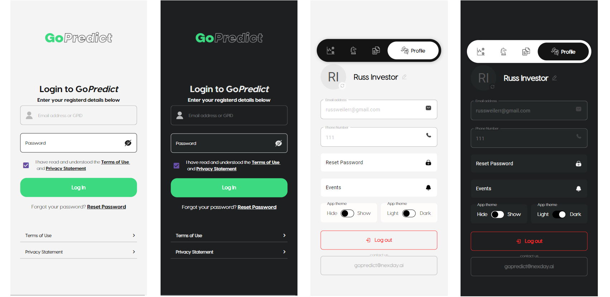
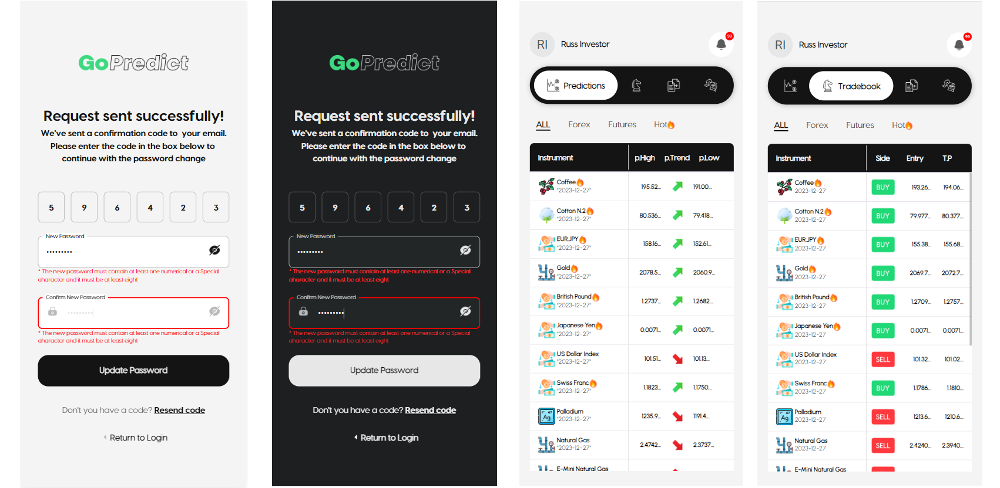

# Wonderful React Native Expo App

**Gopredict** is a project that I made with React Native Expo. I started this project from scratch with React Native.
You can reference several useful funcions through this project.

## Features

- Redux Saga
- Light/Dark theme change
- Custom React Navigation
- OTP
- Login/Logout
- Datatable
- Several Modern UIs(@react-native-material.core, react-native-paper)
- lscache, ExpoSecureStore

## What it looks like

    
    

